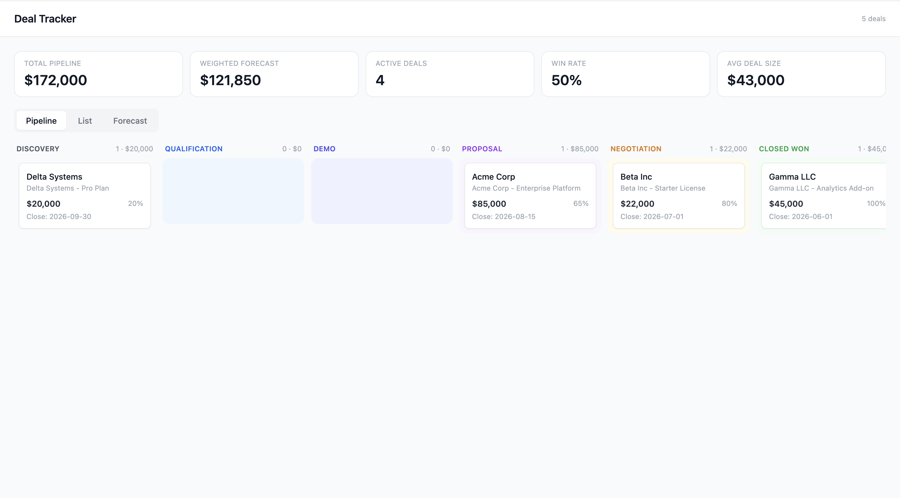

# Deal Tracker

A local dashboard for pre-sales pipeline tracking. Your deals live in plain `.md` files — this app reads them and renders a live dashboard with a Kanban board, metrics strip, sortable table, and revenue forecast chart.

No database. No CRM sync required. Edit a file in your editor and the dashboard updates instantly.



## Features

- **Pipeline board** — Kanban view grouped by deal stage
- **Metrics strip** — total pipeline value, weighted forecast, active deal count, win rate, average deal size
- **Deal list** — sortable and filterable table across all deals
- **Forecast chart** — pipeline vs. weighted revenue by close month
- **Deal drawer** — click any deal to see full rendered notes and metadata
- **Live reload** — the dashboard auto-refreshes when you save a `.md` file

## Getting Started

### Prerequisites

- Python 3.11+
- Node.js 18+

### 1. Clone / open the project

```bash
cd deal_tracker
```

### 2. Start the backend

```bash
cd backend
python -m venv .venv
source .venv/bin/activate      # Windows: .venv\Scripts\activate
pip install -r requirements.txt
cp .env.example .env           # edit DEALS_DIR if your deals folder is elsewhere
uvicorn main:app --reload
```

API runs at `http://localhost:8000`. Docs at `http://localhost:8000/docs`.

### 3. Start the frontend

In a second terminal:

```bash
cd frontend
npm install
npm run dev
```

Dashboard at `http://localhost:5173`.

## Deal File Format

Each deal is a `.md` file in the `deals/` directory. The filename becomes the deal's ID.

```markdown
---
title: Acme Corp - Enterprise Platform
company: Acme Corp
contact: Jane Smith
stage: proposal
value: 85000
probability: 65
close_date: 2026-08-15
created: 2026-04-01
tags: [enterprise, manufacturing]
---

## Notes

- **Apr 1:** Discovery call — pain point is manual reporting.
- **May 14:** Demo completed, strong positive reaction.

## Next Steps

- [ ] Follow up on proposal by June 20
- [x] Send case study
```

### Frontmatter fields

| Field | Type | Description |
|---|---|---|
| `title` | string | Full deal title |
| `company` | string | Company name (primary display label) |
| `contact` | string | Primary contact name |
| `stage` | string | Pipeline stage (see below) |
| `value` | number | Deal value in USD |
| `probability` | number | Win probability 0–100 |
| `close_date` | date | Expected close date (`YYYY-MM-DD`) |
| `created` | date | Date the deal was opened |
| `tags` | list | Free-form tags, e.g. `[enterprise, fintech]` |

### Valid stages

```
discovery → qualification → demo → proposal → negotiation → closed-won
                                                           ↘ closed-lost
```

## Project Structure

```
deal_tracker/
├── deals/              # Your .md deal files — edit these directly
├── backend/            # Python / FastAPI
│   ├── main.py         # API routes + SSE live-reload endpoint
│   ├── parser.py       # Frontmatter + markdown → JSON
│   ├── watcher.py      # File watcher (watchdog → asyncio bridge)
│   └── config.py       # DEALS_DIR, PORT from environment
├── frontend/           # React / TypeScript / Vite
│   └── src/
│       ├── App.tsx
│       ├── components/ # Metrics, Pipeline, DealList, DealDetail, ForecastChart
│       ├── hooks/      # useDeals — fetch + SSE subscription
│       └── types/      # Deal interface, stage definitions
└── docs/               # Architecture rationale and extension ideas
```

## Configuration

Set `DEALS_DIR` in `backend/.env` to point at any folder of `.md` files:

```
DEALS_DIR=/Users/you/Obsidian/deals
PORT=8000
```

## Documentation

- [`docs/architecture.md`](docs/architecture.md) — design decisions and data flow
- [`docs/deal-format.md`](docs/deal-format.md) — full frontmatter field reference
- [`docs/next-steps.md`](docs/next-steps.md) — extension ideas (git history, CRM sync, AI summaries, …)
- [`backend/CLAUDE.md`](backend/CLAUDE.md) — backend internals
- [`frontend/CLAUDE.md`](frontend/CLAUDE.md) — component tree and patterns
